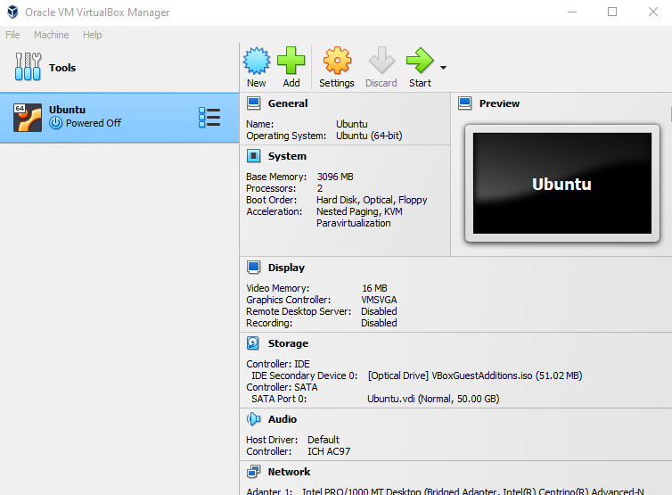
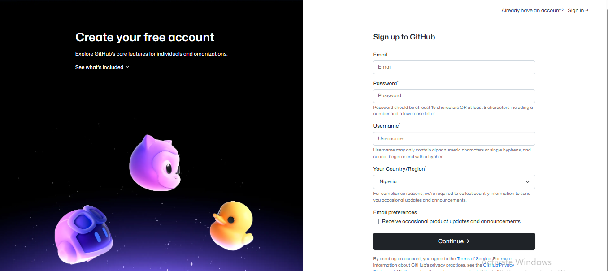
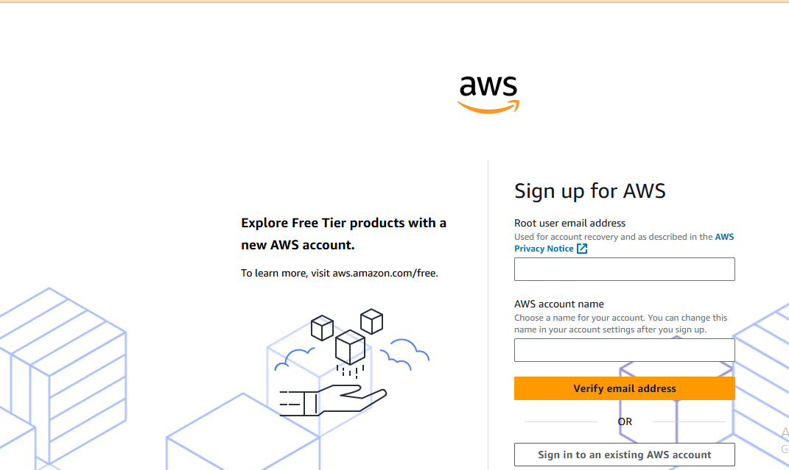
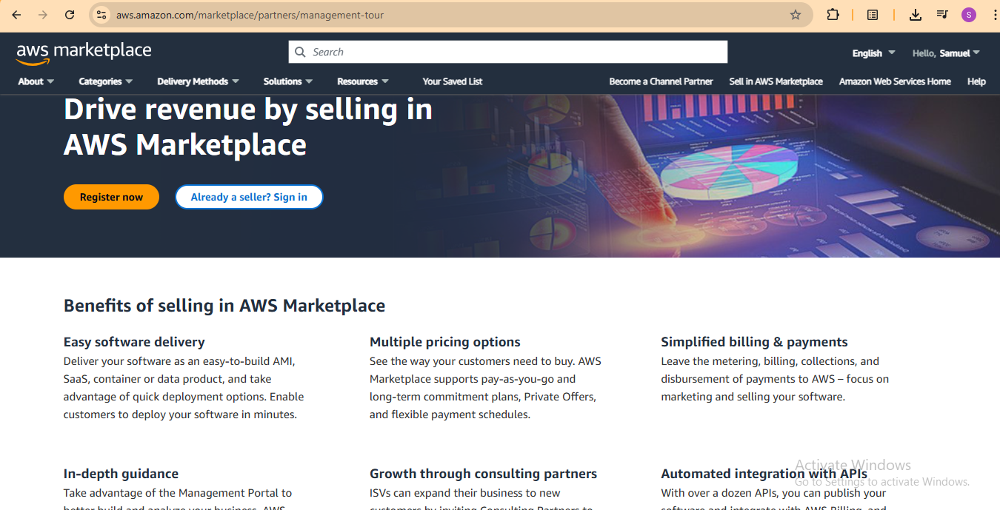

# DevOps Tech Environment Setup Guide

## Introduction

This comprehensive guide provides step-by-step instructions for setting up the necessary tech environment for the DevOps program. Visual aids can significantly enhance understanding. Throughout this document, you'll find suggestions on where to include screenshots or images of the installation and account creation processes.

## Software Installation

### 1. Visual Studio Code (VSCode)

Visual Studio Code is a powerful and versatile code editor that will be used throughout the DevOps program.

**Installation Steps:**

1.  Navigate to the official Visual Studio Code download page: [https://code.visualstudio.com/](https://code.visualstudio.com/)
2.  Download the installer for your operating system (Windows, macOS, or Linux).
    **(Optional: Insert a screenshot here showing the VSCode download page with the download button highlighted.)**
3.  Run the downloaded installer and follow the on-screen instructions. It is generally recommended to accept the default settings.
    **(Optional: Consider adding a screenshot of a key step in the installation wizard.)**
4.  Once the installation is complete, you can launch Visual Studio Code from your applications menu.
    **(Optional: You might include a screenshot of the VSCode welcome screen after installation.)**
5.  To verify the installation, open your command prompt (Windows) or terminal (macOS/Linux) and run the command:
    ```bash
    code --version
    ```
    
**(A screenshot of Welcome Image of Visual Studio Code)** 

### 2. Git

Git is a distributed version control system essential for managing code changes and collaboration.

**Installation Steps:**

1.  Go to the official Git download page: [https://git-scm.com/downloads](https://git-scm.com/downloads)
    **(Optional: Include a screenshot of the Git download page.)**
2.  Download the appropriate version for your operating system.
3.  Run the installer and follow the prompts. For most users, the default settings are suitable.
    
4.  To verify the installation, open your command prompt (Windows) or terminal (macOS/Linux) and run the command:
    ```bash
    git --version
    ```
   
    
    This should display the installed Git version.
    **(Sample output of Successful Installation for git on windowa)** 

### 3. VirtualBox

VirtualBox is a powerful virtualization software that allows you to run other operating systems on your computer. We will use it to run Ubuntu.

**Installation Steps:**

1.  Visit the Oracle VirtualBox download page: [https://www.virtualbox.org/wiki/Downloads](https://www.virtualbox.org/wiki/Downloads)
    **(Optional: Screenshot of the VirtualBox download page.)**
2.  Download the installer for your host operating system (Windows).
3.  Run the installer and follow the on-screen instructions. You may be prompted to install network interfaces; it's generally safe to allow this.

4.  After installation, you can find VirtualBox in your applications menu.
    **Screenshot of the VirtualBox application window installation comfirmation.** 

### 4. Ubuntu on VirtualBox (Windows)

Ubuntu is a popular Linux distribution that we will set up within VirtualBox for a consistent development environment.

**Installation Steps:**

1.  Download the Ubuntu Desktop ISO image from the official Ubuntu website: [https://ubuntu.com/download/desktop](https://ubuntu.com/download/desktop) (Choose the latest LTS version).
    **Screenshot of the Ubuntu download page.** 
2.  Open VirtualBox.
3.  Click on the "New" button to create a new virtual machine.
    ** Screenshot of the Virtual Machine window with the "New" button clicked and location to get the ISO image** 
4.  Enter a name for your virtual machine (e.g., "Ubuntu DevOps").
5.  Select "Linux" as the Type and "Ubuntu (64-bit)" as the Version.
    
6.  Allocate memory (RAM) to the virtual machine. A minimum of 2GB (2048 MB) is recommended, but more can improve performance.
    
7.  For the hard disk, choose "Create a virtual hard disk now" and click "Create."
8.  Select "VDI (VirtualBox Disk Image)" as the hard disk file type.
9.  Choose "Dynamically allocated" for storage on physical hard disk.
10. Allocate the size for your virtual hard disk. 25GB or more is recommended.
11. Click "Create."
12. Select your newly created virtual machine in VirtualBox and click "Start."
13. You will be prompted to select a start-up disk. Browse to the Ubuntu ISO file you downloaded and select it. Click "Start."
14. Follow the Ubuntu installation wizard. Choose your language, keyboard layout, and other preferences.
15. When prompted for the installation type, you can choose "Install Ubuntu."
16. Create a username, password, and computer name for your Ubuntu installation.
17. Once the installation is complete, restart the virtual machine. You may need to remove the ISO image from the virtual machine's settings to prevent booting from it again.
    **Final Ubuntu desktop after successful installation.** 

## Account Creation

### 1. GitHub Account

GitHub is a web-based platform for version control and collaboration using Git.

**Account Creation Steps:**

1.  Go to the GitHub website: [https://github.com/](https://github.com/)
    **Screenshot of the GitHub homepage with the "Sign up" after clicking signUp.** 
2.  Click on the "Sign up" button.
3.  Follow the prompts to create your account, providing a username, email address, and password.
    **Screenshot of the GitHub sign-up form.** 
4.  You may be asked to complete a verification step.
5.  Once your account is created, familiarize yourself with the GitHub interface.
    **A screenshot of your GitHub dashboard. If you are a new user your repository and other data should be empty The screenshot shows a dashoard with history of respositories** 

### 2. Amazon Web Services (AWS) Account

Amazon Web Services (AWS) is a comprehensive and widely adopted cloud platform.

**Account Creation Steps:**

1.  Navigate to the AWS website: [https://aws.amazon.com/](https://aws.amazon.com/)
    **Optional: Screenshot of the AWS homepage with the "Create an AWS Account" button highlighted.** 
2.  Click on the "Create an AWS Account" button.
3.  Follow the on-screen instructions, which will involve providing an email address, password, and AWS account name.
    Screenshot of the initial AWS account creation form.** 
4.  You will need to provide contact information, including your phone number and address.
    **Optional: Screenshot of the contact information section.** 
5.  AWS requires a valid payment method for billing purposes. You will need to enter your credit or debit card details.
6.  You will be asked to verify your phone number.
7.  Choose a support plan. The "Basic" plan is free and suitable for learning purposes.
8.  Once your account is created, you can log in to the AWS Management Console. It's highly recommended to enable Multi-Factor Authentication (MFA) for enhanced security.
    **(Optional: A screenshot of the AWS Management Console dashboard.)** 

## Relevant Information and Next Steps

* **Keep your software updated:** Regularly check for updates to VSCode, Git, VirtualBox, and Ubuntu to ensure you have the latest features and security patches.
* **Secure your accounts:** Use strong, unique passwords for all your online accounts and enable Multi-Factor Authentication (MFA) wherever possible, especially for GitHub and AWS.
* **Explore the tools:** Take some time to familiarize yourself with the basic functionalities of each tool. For example, try creating a simple project in VSCode, making commits with Git, and navigating the Ubuntu environment in VirtualBox. Explore the AWS Management Console to understand the services offered.
* **Refer to official documentation:** For more in-depth information and troubleshooting, refer to the official documentation of each tool and platform.


---

## Conclusion
By following the above steps, you will have successfully set up your tech environment for DevOps. Ensure that all tools are functioning correctly and that your accounts are verified. For any issues, refer to the official documentation of each tool or service.

